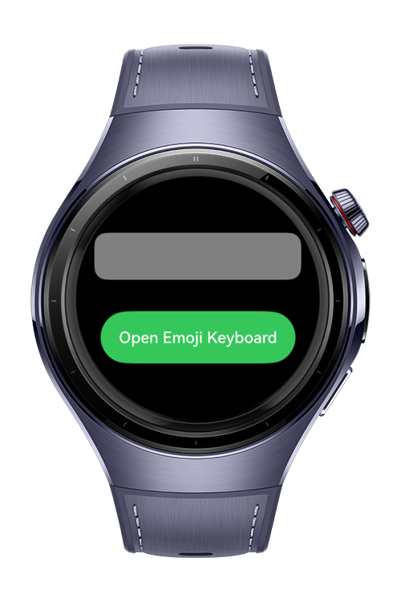
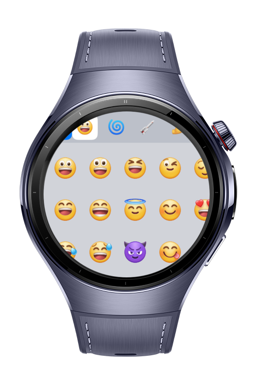
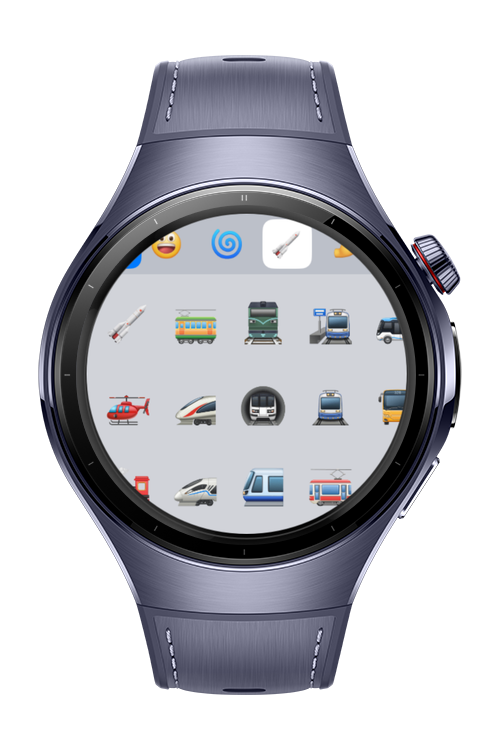
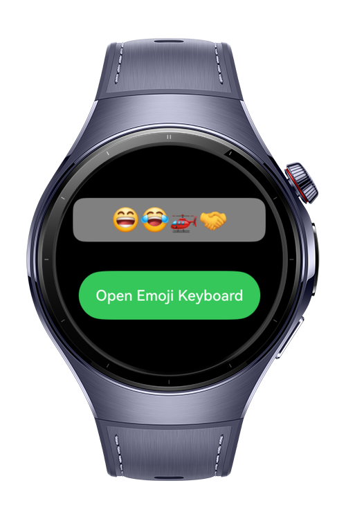

> **Note:** To access all shared projects, get information about environment setup, and view other guides, please visit [Explore-In-HMOS-Wearable Index](https://github.com/Explore-In-HMOS-Wearable/hmos-index).

# How to build custom emoji keyboard

The project is a custom emoji keyboard application built with ArkTS. It demonstrates how to replace the default system letter keyboard with an emoji-only panel that appears whenever a text input gains focus. The application generates its emoji set programmatically from Unicode code point ranges, filters out unassigned and component code points, groups the result into named categories, and renders them in a horizontally scrolling grid sized for smart watch screens.

# Preview
<div>
  
  
  
  
</div>

# Use Cases
- Replacing the system letter keyboard with a custom panel via the customKeyboard attribute
- Opening the custom keyboard programmatically through focusControl.requestFocus
- Dismissing the keyboard from inside the panel using TextInputController.stopEditing
- Generating a complete emoji set from Unicode code point ranges at runtime
- Filtering unassigned code points and Emoji_Component characters to avoid blank glyphs
- Forcing emoji presentation on text-default characters with variation selector U+FE0F
- Horizontal category bar with a representative emoji per category
- Three-row horizontally scrolling emoji grid optimized for watch screens
- Appending the selected emoji to the bound text state on tap

# Tech Stack
**Languages**: ArkTS  
**Libraries/Kits**:
- @kit.ArkUI - TextInput, TextInputController, customKeyboard, Grid, GridItem, List, ListItem, Button, focusControl

# Directory Structure

```
entry/src/main/
└───main
    │   module.json5
    ├───ets
    │   └───model
    │           UnicodeEmoji.ets
    │   ├───pages
    │   │       Index.ets // All logic
    │   │
    │
    └───resources
        └───base
            └───profile
                    main_pages.json
```

# Constraints and Restrictions
## Supported Devices
- Kids Watch
- Watch 5
- Ultimate 2

# LICENSE
**How to build custom emoji keyboard** is distributed under the terms of the **MIT License**.
See the [LICENSE](/LICENSE) for more information.